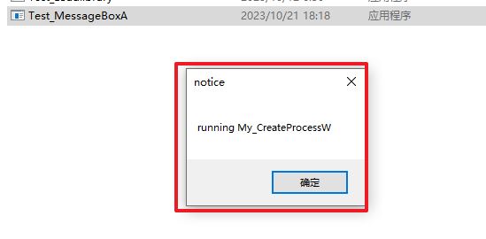

## 

# 0x01 项目简介

通过inlinehook实现对某些进程全局hook，hook关键winapi，可以用于快速的样本分析，如拿到回连c2和查看样本的相关操作（对没有做反虚拟化反沙箱的样本）

### 原理：

通过远程进程注入系统进程explorer.exe，hook该进程的CreateProcessA/W api，对其产生的所有子进程进行注入，从而实现对其所有子进程进行监测，因为我们双击运行的样本或者执行相关exe的时候，其父进程都是explorer.exe

### 原理图：


# 0x02 项目文件

## Explore_Inject 

注入进程：Inject.exe


## Mydll_HookCreateProcess

A.dll  ，使用的时候放到  ``C:\Windows\Temp``中


## Mydll_HookSomeSensitive

B.dll , 使用的时候放到  ``C:\Windows\Temp``中


## Test_connect

测试程序，双击运行，进程的功能就是外联一个IP


## Test_MessageBoxA

测试程序，双击运行，运行MessageBoxA


# 0x03 效果

1、将两个dll丢入指定路径：


2、运行inject，注入explorer.exe


3、运行Messagebox 程序：因为其父进程是explorer.exe 这里运行的是我们定义的My_CreateProcess




4、运行connect 进程，同目录出现out.txt，里面记录了，调用ws2_32.dll 里面的connect建立连接的记录：


# 0x04 待做

1、增加劫持的函数个数，补充监测点：对以下操作也做记录：

- 文件操作

- 注册表操作

2、对抗一些反分析函数，劫持一些反虚拟化、反沙箱技术可能会使用的函数；从而绕过对虚拟环境的检测

比如一些cpu、内核、内存查询的api：

```
kernel32.dll GlobalMemoryStatusEx		//内存大小
kernel32.dll GetSystemInfo        //从这拿cpu个数
```

